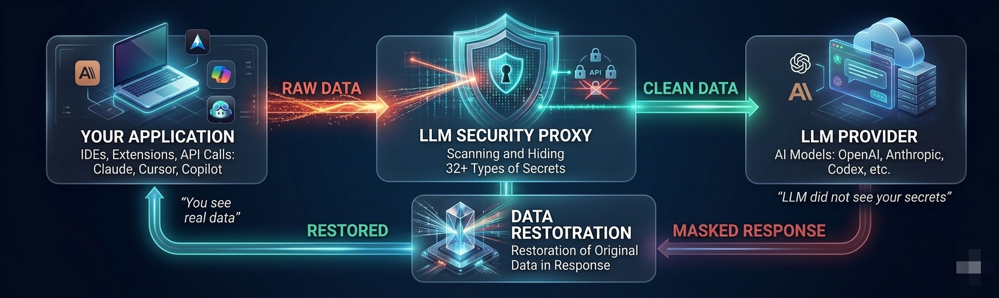
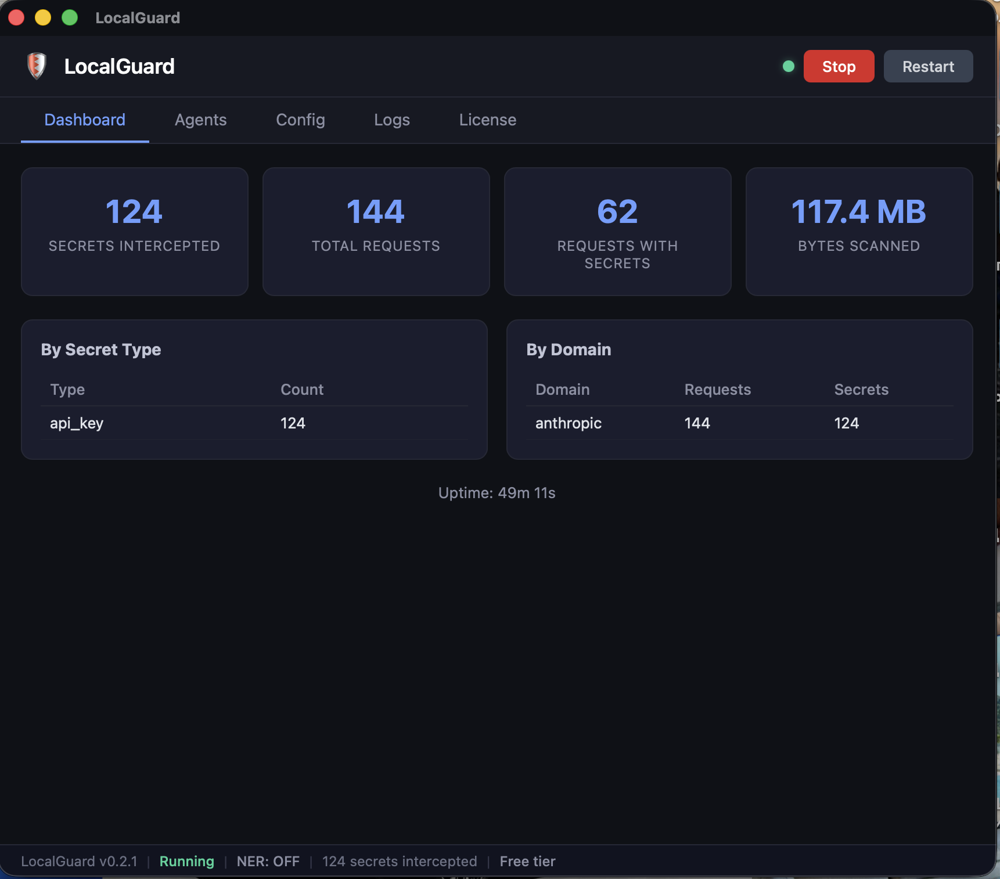
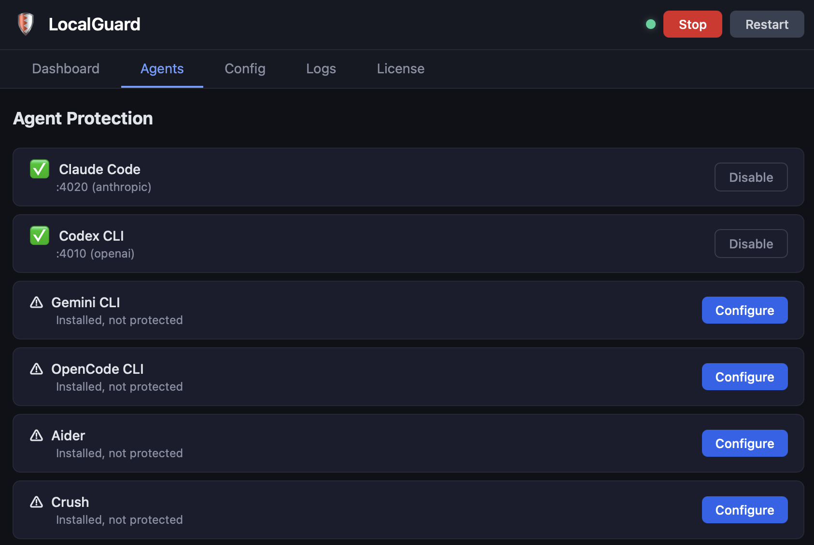
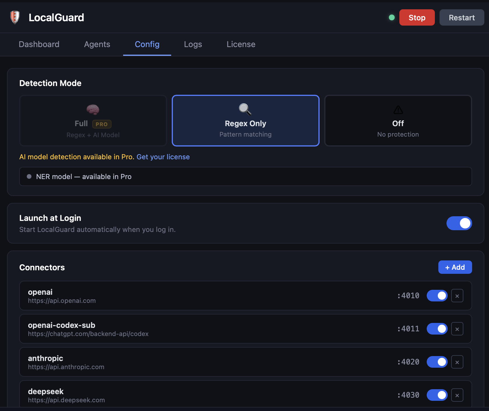
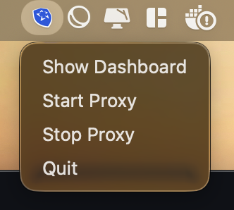
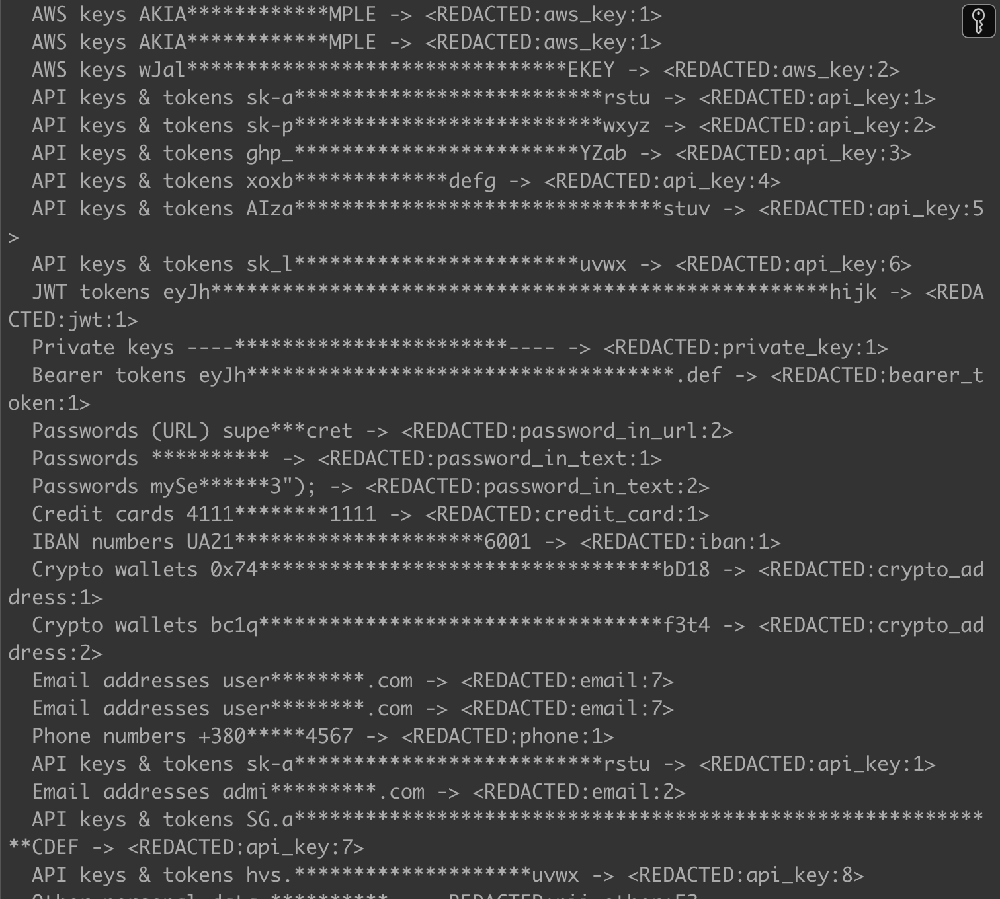

# LocalGuard

**[localguard.me](https://localguard.me)** — Transparent HTTP proxy that redacts secrets and PII before they reach LLM providers. Your API keys, passwords, credit cards, and personal data never leave your machine.



## Desktop App

LocalGuard comes with a native desktop app for macOS, Windows, and Linux. Start/stop the proxy, monitor intercepted secrets, configure providers, and manage your license — all from a single window.

| Dashboard | Agent Protection | Configuration |
|:---------:|:----------------:|:-------------:|
|  |  |  |

Runs in your system tray — always on, always protecting.



## CLI

For headless servers, CI/CD pipelines, or if you prefer the terminal:



## Install

### Homebrew (macOS / Linux) — recommended

```bash
brew tap lexus2016/tap
```

**Desktop App (GUI):**
```bash
brew install --cask localguard
```
No Gatekeeper warnings — works immediately after install.

**CLI:**
```bash
brew install localguard
```

**Auto-start on login:**
```bash
brew services start localguard
```

### Desktop App (manual download)

| Platform | Download |
|----------|----------|
| macOS (Apple Silicon) | [LocalGuard.dmg](https://github.com/Lexus2016/LocalGuard/releases/latest) |
| Linux (x64) | [.deb](https://github.com/Lexus2016/LocalGuard/releases/latest) / [.AppImage](https://github.com/Lexus2016/LocalGuard/releases/latest) |
| Windows (x64) | [LocalGuard_*.msi](https://github.com/Lexus2016/LocalGuard/releases/latest) |

> **macOS note:** If you downloaded the DMG manually (not via Homebrew), macOS Gatekeeper may block it. Run once:
> ```bash
> xattr -cr /Applications/LocalGuard.app
> ```

### CLI (script install)

**macOS / Linux:**
```bash
curl -fsSL https://raw.githubusercontent.com/Lexus2016/LocalGuard/main/install.sh | sh
```

**Auto-start on boot (after script install):**
```bash
llm-security-proxy install
```

The installer downloads the binary and the detection model (~200MB total). Everything works out of the box after installation.

### Manual install

Download the archive for your platform from [Releases](https://github.com/Lexus2016/LocalGuard/releases/latest), extract it, and place the binary in your PATH.

**macOS (Apple Silicon):**
```bash
tar xzf llm-security-proxy-*-aarch64-apple-darwin.tar.gz
sudo mv llm-security-proxy /usr/local/bin/
```

**Linux (x86_64):**
```bash
tar xzf llm-security-proxy-*-x86_64-unknown-linux-gnu.tar.gz
sudo mv llm-security-proxy /usr/local/bin/
```

**Linux (ARM64):**
```bash
tar xzf llm-security-proxy-*-aarch64-unknown-linux-gnu.tar.gz
sudo mv llm-security-proxy /usr/local/bin/
```

**Windows (x86_64):**
```powershell
tar -xzf llm-security-proxy-*-x86_64-pc-windows-msvc.tar.gz
# Move llm-security-proxy.exe to a directory in your PATH
```

**Windows (ARM64):**
```powershell
tar -xzf llm-security-proxy-*-aarch64-pc-windows-msvc.tar.gz
# Move llm-security-proxy.exe to a directory in your PATH
```

## Quick Start

### 1. Start the proxy

```bash
llm-security-proxy start
```

On first run, LocalGuard creates a default config with all popular providers (OpenAI, Anthropic, DeepSeek, etc.). You're ready to go immediately.

### 2. Get a license (optional)

Free mode works with pattern-based scanning. For full AI-powered detection (names, addresses, contextual secrets) — powered by a local AI model that runs entirely on your machine with zero data sent to external services — subscribe at **[localguard.me](https://localguard.me/buy)**:

```bash
llm-security-proxy activate
```

Paste your license key when prompted. Done.

### 3. Point your app to localhost

Instead of `https://api.openai.com`, use `http://localhost:4010`. That's it.

```bash
# Example: OpenAI through LocalGuard
curl http://localhost:4010/v1/chat/completions \
  -H "Authorization: Bearer sk-..." \
  -H "Content-Type: application/json" \
  -d '{"model":"gpt-4","messages":[{"role":"user","content":"Hello"}]}'
```

## Supported Providers

### Pre-configured (works out of the box)

| Provider | Default Port | Upstream |
|----------|-------------|----------|
| OpenAI | 4010 | api.openai.com |
| Anthropic | 4020 | api.anthropic.com |
| DeepSeek | 4030 | api.deepseek.com |
| OpenRouter | 4040 | openrouter.ai |
| Ollama | 4050 | localhost:11434 |
| Google Gemini | 4060 | generativelanguage.googleapis.com |
| xAI (Grok) | 4070 | api.x.ai |

### Easy to add (one line in config)

These providers can be added with a single entry in `~/.llm-proxy/config.yaml`:

| Provider | Upstream |
|----------|----------|
| Mistral | api.mistral.ai |
| Groq | api.groq.com |
| Together AI | api.together.xyz |
| Fireworks AI | api.fireworks.ai |
| Perplexity | api.perplexity.ai |
| Cohere | api.cohere.com |
| Hugging Face | api-inference.huggingface.co |
| Replicate | api.replicate.com |
| NVIDIA NIM | integrate.api.nvidia.com |
| Azure OpenAI | *.openai.azure.com |
| AWS Bedrock | bedrock-runtime.*.amazonaws.com |
| Google Vertex AI | *-aiplatform.googleapis.com |
| LM Studio | localhost:1234 |
| vLLM | localhost:8000 |
| LocalAI | localhost:8080 |

### Custom / self-hosted providers

Any HTTP API can be proxied. Add to `~/.llm-proxy/config.yaml`:

```yaml
providers:
  - name: my-custom-llm
    listen_port: 4300
    upstream: "https://my-llm-server.internal:8443"
    path_prefix: "/v1"
```

This works with any self-hosted model server, fine-tuned model endpoints, or internal LLM gateways.

## What gets redacted

| Category | Examples |
|----------|----------|
| API keys | OpenAI, Anthropic, AWS, GitHub, Stripe, Slack, SendGrid, Shopify |
| Passwords | In plaintext, URLs, config files |
| Credit cards | Visa, Mastercard, Amex (Luhn-validated) |
| Emails & phones | RFC 5322 emails, international phone numbers |
| Tokens | JWT, Bearer tokens |
| Financial | IBAN, crypto addresses (Bitcoin, Ethereum) |
| Crypto keys | PEM private keys (RSA, EC, ED25519) |
| Personal names | Via local AI model (runs on your machine, nothing sent externally) |
| Locations | Cities, countries, addresses (local AI model) |

## Pricing

| | Free | Personal |
|------|------|---------|
| Price | $0 | $39/year |
| Pattern-based scanning | Yes | Yes |
| Local AI model detection | No | Yes |
| Name/address detection | No | Yes |
| Bind address | localhost | localhost |
| Support | Community | Email |

Subscribe at **[localguard.me](https://localguard.me/buy)**.

## Commands

```bash
llm-security-proxy start            # Start the proxy (auto-creates config on first run)
llm-security-proxy stop             # Stop the running daemon
llm-security-proxy status           # Show daemon status
llm-security-proxy restart          # Restart the daemon
llm-security-proxy install          # Auto-start on boot (launchd/systemd)
llm-security-proxy uninstall        # Remove auto-start
llm-security-proxy activate         # Activate license
llm-security-proxy license          # Show license status
llm-security-proxy fingerprint      # Show machine fingerprint
llm-security-proxy update           # Check for updates / update to latest
llm-security-proxy stats            # Show protection statistics
llm-security-proxy check-config     # Validate config file
```

## Performance

- Local AI analysis: 20-40ms per message (Apple Silicon)
- Pattern scanning: <1ms
- Memory: ~400MB RSS with model loaded
- Tested with 100 concurrent agents at 0 errors

## FAQ

**Can I use LocalGuard for free?**
Yes. Free mode provides pattern-based scanning (API keys, passwords, credit cards, emails, etc.). Subscribe for AI-powered detection of names, addresses, and context-dependent secrets. The AI model runs entirely on your machine — no data is sent to external services.

**How to update?**
Desktop app updates automatically. CLI:
```bash
brew upgrade localguard
# or
llm-security-proxy update
```

**Changed your computer?**
Each license is tied to one machine fingerprint. Contact support to transfer.

**Manage your subscription?**
Visit the customer portal via the GUI or at [localguard.me](https://localguard.me).

## License

MIT
